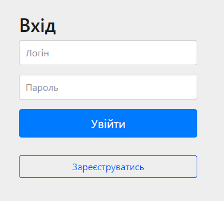
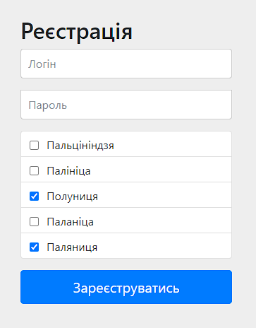
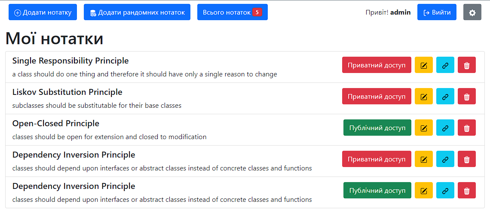
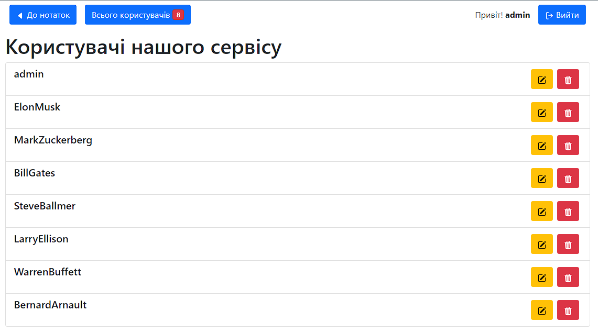

# java-final-team-project-notes

## BeesTeam

---

Default credentials:

`admin` `super_secret_password`

---

Environment Variables:

- `PROFILE` (default - `dev`; production - `prod`)
- `DB_URL`
- `DB_USERNAME`
- `DB_PASSWORD`

---

### Technologies used in project

- Spring Boot
- Spring MVC
- Spring Security
- Spring Data
- Spring Validation
- Thymeleaf + Bootstrap
- Flyway
- Database production PostgreSQL
- Database development H2
- Commonmark
- JavaScript
- HTML

---

### Login page

---

### Register page

>Here  we have custom validation

---

### Notes List page

Here you can: Create, Read, Update, Delete your notes. Copy link by pressing button Link.
Add mock notes. Use admin panel if you logged as admin. And Quit.

---

### Service users page

As Admin here you can: see all users, choose user to update, delete any user.

---

### Edit user page

As Admin here you can: edit information about user.

---

Every input field has validation

---

Database PostgreSQL is located on home Synology NAS in a docker container.